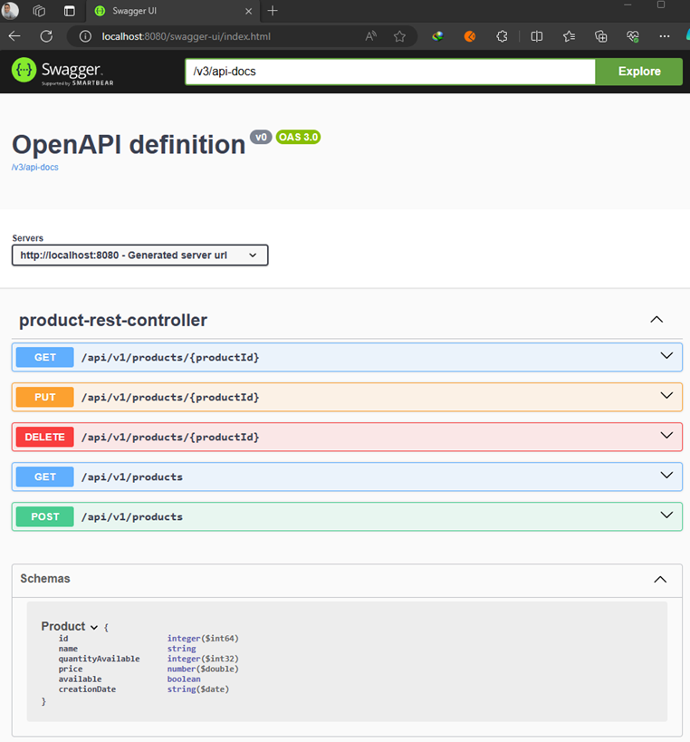
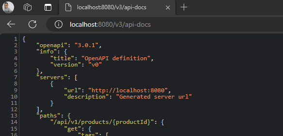

# [Spring Boot 3 + Swagger 3 example (with OpenAPI 3)](https://www.bezkoder.com/spring-boot-swagger-3/)

- Tutorial tomado de la página web de **BezKoder**.
- Sitio web de la [OpenAPI Specification](https://swagger.io/specification/)
- Sitio web del documento de [OpenAPI Specification v3.1.0](https://spec.openapis.org/oas/latest.html)

---

## Dependencias iniciales

````xml
<!--Spring Boot 3.2.3-->
<!--Java 21-->
<dependencies>
    <dependency>
        <groupId>org.springframework.boot</groupId>
        <artifactId>spring-boot-starter-data-jpa</artifactId>
    </dependency>
    <dependency>
        <groupId>org.springframework.boot</groupId>
        <artifactId>spring-boot-starter-web</artifactId>
    </dependency>

    <dependency>
        <groupId>com.mysql</groupId>
        <artifactId>mysql-connector-j</artifactId>
        <scope>runtime</scope>
    </dependency>
    <dependency>
        <groupId>org.projectlombok</groupId>
        <artifactId>lombok</artifactId>
        <optional>true</optional>
    </dependency>
    <dependency>
        <groupId>org.springframework.boot</groupId>
        <artifactId>spring-boot-starter-test</artifactId>
        <scope>test</scope>
    </dependency>
</dependencies>
````

## Configuración inicial

````yaml
server:
  port: 8080
  error:
    include-message: always

spring:
  application:
    name: spring-boot-swagger

  datasource:
    url: jdbc:mysql://localhost:3306/db_spring_data_jpa
    username: admin
    password: magadiflo

  jpa:
    hibernate:
      ddl-auto: create-drop
    properties:
      hibernate:
        format_sql: true

logging:
  level:
    org.hibernate.SQL: DEBUG
````

# Proyecto sin Swagger

A continuación se muestra, a modo de documentación rápida, el crud realizado en este proyecto, por ahora sin el uso
de **Swagger**:

## Entidad

````java

@AllArgsConstructor
@NoArgsConstructor
@Builder
@Data
@Entity
@Table(name = "products")
public class Product {
    @Id
    @GeneratedValue(strategy = GenerationType.IDENTITY)
    private Long id;
    private String name;
    private Integer quantityAvailable;
    private Double price;
    private Boolean available;
    private LocalDate creationDate;
}
````

## Repositorio

````java
public interface IProductRepository extends JpaRepository<Product, Long> {
}
````

## Capa de servicio

````java
public interface IProductService {
    List<Product> findAllProducts();

    Product findProductById(Long id);

    Product saveProduct(Product product);

    Product updateProduct(Long id, Product product);

    void deleteProductById(Long id);
}
````

````java

@RequiredArgsConstructor
@Slf4j
@Service
public class ProductServiceImpl implements IProductService {

    private final IProductRepository productRepository;

    @Override
    public List<Product> findAllProducts() {
        return this.productRepository.findAll();
    }

    @Override
    public Product findProductById(Long id) {
        return this.productRepository.findById(id)
                .orElseThrow(() -> new ApiException("No existe el producto con el id: " + id, HttpStatus.NOT_FOUND));
    }

    @Override
    public Product saveProduct(Product product) {
        return this.productRepository.save(product);
    }

    @Override
    public Product updateProduct(Long id, Product product) {
        return this.productRepository.findById(id)
                .map(productDB -> {
                    productDB.setName(product.getName());
                    productDB.setQuantityAvailable(product.getQuantityAvailable());
                    productDB.setPrice(product.getPrice());
                    productDB.setAvailable(product.getAvailable());
                    productDB.setCreationDate(product.getCreationDate());
                    return productDB;
                })
                .map(this.productRepository::save)
                .orElseThrow(() -> new ApiException("No existe el producto para actualizar con el id: " + id, HttpStatus.NOT_FOUND));
    }

    @Override
    public void deleteProductById(Long id) {
        this.productRepository.findById(id)
                .map(productDB -> {
                    this.productRepository.deleteById(productDB.getId());
                    return true;
                })
                .orElseThrow(() -> new ApiException("No existe el producto para eliminar con el id: " + id, HttpStatus.NOT_FOUND));
    }
}
````

## Capa Web

````java
public record ResponseMessage<T>(String message,
                                 @JsonInclude(JsonInclude.Include.NON_NULL) T content) {
}
````

````java

@RestControllerAdvice
public class ApiAdvice {
    @ExceptionHandler(ApiException.class)
    public ResponseEntity<ResponseMessage<Void>> apiException(ApiException e) {
        ResponseMessage<Void> response = new ResponseMessage<>(e.getMessage(), null);
        return ResponseEntity.status(e.getHttpStatus()).body(response);
    }
}
````

````java

@RequiredArgsConstructor
@Slf4j
@RestController
@RequestMapping(path = "/api/v1/products")
public class ProductRestController {

    private final IProductService productService;

    @GetMapping
    public ResponseEntity<List<Product>> getAllProducts() {
        return ResponseEntity.ok(this.productService.findAllProducts());
    }

    @GetMapping(path = "/{productId}")
    public ResponseEntity<Product> getProduct(@PathVariable Long productId) {
        return ResponseEntity.ok(this.productService.findProductById(productId));
    }

    @PostMapping
    public ResponseEntity<Product> saveProduct(@RequestBody Product product) {
        Product productDB = this.productService.saveProduct(product);
        URI uri = URI.create("/api/v1/products/" + productDB.getId());
        return ResponseEntity.created(uri).body(productDB);
    }

    @PutMapping(path = "/{productId}")
    public ResponseEntity<Product> updateProduct(@PathVariable Long productId, @RequestBody Product product) {
        return ResponseEntity.ok(this.productService.updateProduct(productId, product));
    }

    @DeleteMapping(path = "/{productId}")
    public ResponseEntity<Void> deleteProduct(@PathVariable Long productId) {
        this.productService.deleteProductById(productId);
        return ResponseEntity.noContent().build();
    }
}
````

## Exception

````java

@Getter
public class ApiException extends RuntimeException {

    private final HttpStatus httpStatus;

    public ApiException(String message, HttpStatus httpStatus) {
        super(message);
        this.httpStatus = httpStatus;
    }
}
````

---

# Trabajando con Swagger

---

## [OpenAPI Specification v3.1.0](https://spec.openapis.org/oas/latest.html)

La `especificación OpenAPI (OAS)` define una descripción de interfaz estándar independiente del lenguaje de programación
para las API HTTP, que permite que tanto humanos como computadoras descubran y comprendan las capacidades de un servicio
sin requerir acceso al código fuente, documentación adicional o inspección del tráfico de la red. Cuando se define
correctamente a través de `OpenAPI`, un consumidor puede comprender e interactuar con el servicio remoto con una
cantidad mínima de lógica de implementación.

Luego, las herramientas de generación de documentación para mostrar la API, las herramientas de generación de código
para generar servidores y clientes en varios lenguajes de programación, las herramientas de prueba y muchos otros casos
de uso
`pueden utilizar una definición de OpenAPI`. [Fuente: swagger.io/specification](https://swagger.io/specification/)

Con la `versión 3.1.0`, la especificación OpenAPI establece un conjunto de pautas para el desarrollo y la documentación
de API, que abarca control de versiones, esquema, estructura de documentos y otros elementos críticos, lo que contribuye
a crear APIs confiables y consistentes.

## [Swagger 3](https://swagger.io/docs/specification/about/)

El `OpenAPI specification` define la especificación estándar de la industria para **diseñar API REST**, mientras que
`Swagger` proporciona una **variedad de herramientas (Swagger Editor, Swagger UI, Swagger Codegen, etc.)**
para respaldar el desarrollo, las pruebas y la documentación de estas API.

> Entonces podemos pensar en `Swagger 3` como una `implementación` de la `OpenAPI 3 Specification`.

## Swagger 3 vs OpenAPI 3

- `Todas las herramientas Swagger`, compatibles con el software **SmartBear**, utilizan la `especificación OpenAPI`.
- Pero no todas las herramientas `OpenAPI` son herramientas `Swagger`. Hay muchas herramientas profesionales y de código
  abierto que no están relacionadas con Swagger y son compatibles con la `especificación OpenAPI 3`.

## [springdoc-openapi v2.3.0](https://springdoc.org/)

`Springdoc-openapi` es una librería que se integra con el `framework Spring Boot` para **generar automáticamente
documentación OpenAPI para APIs REST.** Permite a los desarrolladores describir sus endpoints y modelos de API
mediante anotaciones y genera una especificación OpenAPI en formato `JSON/YAML y HTML`.

También es **compatible con varias funciones de la especificación OpenAPI 3**, como las definiciones de seguridad, la
validación de esquemas y la autenticación JSON Web Token (JWT).

Además, **se integra con otras bibliotecas de Spring Boot, como Spring WebMvc/WebFlux, Spring Data Rest,
Spring Security y Spring Cloud Function Web**, para generar también automáticamente documentación para estos
componentes.

Esta librería admite:

- OpenAPI 3
- Spring Boot 3
- JSR-303, específicamente para @NotNull, @Min, @Max y @Size.
- Swagger-ui
- OAuth 2
- GraalVM native images

**IMPORTANTE**
> `springdoc-openapi v1.7.0` es la última versión de código abierto que admite `Spring Boot 2.x y 1.x`.
> Ya está disponible un soporte ampliado para el proyecto `springdoc-openapi v1` para organizaciones que necesiten
> soporte más allá de 2023.

## Getting Started

Para la integración entre `spring-boot y swagger-ui`, agregue la biblioteca a la lista de dependencias de su proyecto
`(no se necesita configuración adicional)`.

`Para Spring Boot 3`

````xml

<dependencies>
    <dependency>
        <groupId>org.springdoc</groupId>
        <artifactId>springdoc-openapi-starter-webmvc-ui</artifactId>
        <version>2.3.0</version>
    </dependency>
</dependencies>
````

`Para Spring Boot 2`

````xml

<dependencies>
    <dependency>
        <groupId>org.springdoc</groupId>
        <artifactId>springdoc-openapi-ui</artifactId>
        <version>1.7.0</version>
    </dependency>
</dependencies>
````

Esto implementará automáticamente `swagger-ui` en una aplicación de `Spring Boot`:

- La documentación estará disponible en formato HTML, utilizando los archivos oficiales swagger-ui.
- La página de la interfaz de usuario de Swagger estará disponible en:<br>
  `http://server:port/context-path/swagger-ui.html`
- La descripción de OpenAPI estará disponible en la siguiente URL en formato json:<br>
  `http://server:port/context-path/v3/api-docs`.
    - server: El nombre del servidor o IP.
    - port: El puerto del servidor.
    - context-path: la ruta de contexto de la aplicación.
- La documentación **también puede estar disponible en formato yaml**, en la siguiente ruta: `/v3/api-docs.yaml`

Para obtener una ruta personalizada de la documentación de swagger en formato HTML, agregue una propiedad springdoc
personalizada en su archivo de configuración spring-boot:

````properties
# swagger-ui custom path
springdoc.swagger-ui.path=/swagger-ui.html
````

## Ejecutando proyecto y comprobando

Sin haber realizado ninguna configuración, tan solo agregando la dependencia de `swagger` mostrada en el párrafo
superior, ejecutamos el proyecto `Spring Boot`, abrimos el navegador e ingresamos la siguiente dirección:

````bash
$ http://localhost:8080/swagger-ui.html
````

Al dar enter, seremos redireccionados a la siguiente dirección (podríamos haber ingresado directamente a la url de
abajo, pero lo hice para ver de dónde es que sale):

````bash
$ http://localhost:8080/swagger-ui/index.html
````

En la imagen siguiente observamos la interfaz gráfica de `Swagger-ui`:



Si ingresamos a la siguiente dirección veremos el documento en formato json:

````bash
$ http://localhost:8080/v3/api-docs
````



El json completo sería el siguiente:

````json
{
  "openapi": "3.0.1",
  "info": {
    "title": "OpenAPI definition",
    "version": "v0"
  },
  "servers": [
    {
      "url": "http://localhost:8080",
      "description": "Generated server url"
    }
  ],
  "paths": {
    "/api/v1/products/{productId}": {
      "get": {
        "tags": [
          "product-rest-controller"
        ],
        "operationId": "getProduct",
        "parameters": [
          {
            "name": "productId",
            "in": "path",
            "required": true,
            "schema": {
              "type": "integer",
              "format": "int64"
            }
          }
        ],
        "responses": {
          "200": {
            "description": "OK",
            "content": {
              "*/*": {
                "schema": {
                  "$ref": "#/components/schemas/Product"
                }
              }
            }
          }
        }
      },
      "put": {
        "tags": [
          "product-rest-controller"
        ],
        "operationId": "updateProduct",
        "parameters": [
          {
            "name": "productId",
            "in": "path",
            "required": true,
            "schema": {
              "type": "integer",
              "format": "int64"
            }
          }
        ],
        "requestBody": {
          "content": {
            "application/json": {
              "schema": {
                "$ref": "#/components/schemas/Product"
              }
            }
          },
          "required": true
        },
        "responses": {
          "200": {
            "description": "OK",
            "content": {
              "*/*": {
                "schema": {
                  "$ref": "#/components/schemas/Product"
                }
              }
            }
          }
        }
      },
      "delete": {
        "tags": [
          "product-rest-controller"
        ],
        "operationId": "deleteProduct",
        "parameters": [
          {
            "name": "productId",
            "in": "path",
            "required": true,
            "schema": {
              "type": "integer",
              "format": "int64"
            }
          }
        ],
        "responses": {
          "200": {
            "description": "OK"
          }
        }
      }
    },
    "/api/v1/products": {
      "get": {
        "tags": [
          "product-rest-controller"
        ],
        "operationId": "getAllProducts",
        "responses": {
          "200": {
            "description": "OK",
            "content": {
              "*/*": {
                "schema": {
                  "type": "array",
                  "items": {
                    "$ref": "#/components/schemas/Product"
                  }
                }
              }
            }
          }
        }
      },
      "post": {
        "tags": [
          "product-rest-controller"
        ],
        "operationId": "saveProduct",
        "requestBody": {
          "content": {
            "application/json": {
              "schema": {
                "$ref": "#/components/schemas/Product"
              }
            }
          },
          "required": true
        },
        "responses": {
          "200": {
            "description": "OK",
            "content": {
              "*/*": {
                "schema": {
                  "$ref": "#/components/schemas/Product"
                }
              }
            }
          }
        }
      }
    }
  },
  "components": {
    "schemas": {
      "Product": {
        "type": "object",
        "properties": {
          "id": {
            "type": "integer",
            "format": "int64"
          },
          "name": {
            "type": "string"
          },
          "quantityAvailable": {
            "type": "integer",
            "format": "int32"
          },
          "price": {
            "type": "number",
            "format": "double"
          },
          "available": {
            "type": "boolean"
          },
          "creationDate": {
            "type": "string",
            "format": "date"
          }
        }
      }
    }
  }
}
````
